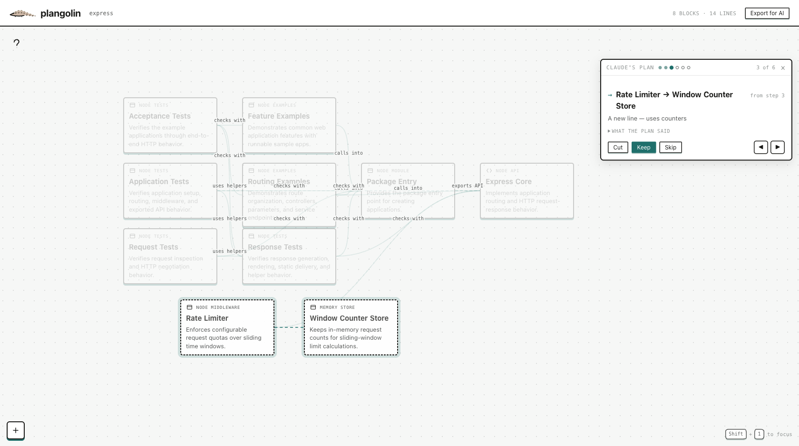

<p align="center">
  
</p>

<p align="center">
  Turn an AI agent's wall-of-text plan into a visual preview of what it would change.
</p>

<p align="center">
  <em><strong>Plan review for AI coding agents.</strong>
  Reads JavaScript, TypeScript, Python and Go.
  <br />
  Ships as a Claude Code plugin; Codex support is in the works.
  No API key, no account, no build step.</em>
</p>

<p align="center">
  <a href="https://github.com/jakekeech/plangolin/actions/workflows/test.yml"></a>
  <a href="LICENSE"></a>
  
  
  <a href="https://code.claude.com/docs/en/plugins-reference"></a>
</p>

<p align="center">
  <a href="#quick-start">Quick start</a> ·
  <a href="#how-it-works">How it works</a> ·
  <a href="#why-a-graph">Why a graph</a> ·
  <a href="#privacy-and-failure-behaviour">Privacy</a> ·
  <a href="#what-it-does-not-do">What it does not do</a> ·
  <a href="#development">Development</a>
</p>

## Quick start

Requires **Node 20+** and **Claude Code**. Nothing else — no API key, no
account, no build step.

In Claude Code:

```text
/plugin marketplace add jakekeech/plangolin
/plugin install plangolin
```

Restart Claude Code once after installing, then run this in any project:

```text
/plangolin "add rate limiting to the API"
```

Claude plans the change, starts the review, and waits:

```text
Open http://localhost:4300 to review the plan.
```

Open the link, review the proposals, and press **Approve**. That is the whole
setup: no separate npm install, API key, account, or build step.

## How it works

1. **Ask for a change.** Claude reads the project and writes its plan without
   changing any files.
2. **See the plan on your system.** plangolin draws proposed blocks and
   connections as ghosts over a graph of what already exists.
3. **Keep or cut each proposal.** Step through the architectural changes and
   cross out anything you did not ask for.
4. **Send the decision back.** Claude continues with what survived, plus an
   explicit `OUT OF SCOPE` list so every rejection remains an instruction.



<p align="center">
  <em>A plan to add rate limiting to Express, drawn against Express's own code.</em>
</p>

Implementation details stay visible without competing for the same attention.
At the end, plangolin counts the plan steps that change nothing about the shape
of the system—the part of a long plan you are entitled to skim.

## What you are reviewing

**Solid blocks** are parts of the system that already exist. **Dashed blocks
and lines** are what the plan proposes to add. A travelling dash shows which
way a proposed connection runs.

The current proposal is lit; everything else dims. It dims rather than
disappearing because the rest of the system is what makes the proposed change
mean anything.

| Control | Action |
|---|---|
| `←` `→` | Step through proposals one at a time |
| `K` / `C` | Keep or cut the current proposal |
| **?** | Show the request that started the plan |
| **drag the title bar** | Move the review panel |
| **▸ what the plan said** | Check the proposal against the plan's own wording |

Nothing opens a browser tab automatically. Set `PLANGOLIN_OPEN=1` if you want
the review to open itself.

## Why a graph

An AI plan can be six hundred words, and most of them describe *how*: which
file, which function, and in what order. The smaller—but more consequential—part
says what will change about the shape of the system. That is the part a user
needs to agree to, and the part prose makes hardest to see.

Asking the agent to summarize produces more prose from the thing being
reviewed. Waiting for the diff is too late: the code already exists. plangolin
puts the proposed change on the system it would affect, before implementation
starts.

A rejection must also leave a trace. Silently dropping a proposal looks the
same as never considering it; returning it under `OUT OF SCOPE` turns it into a
rule the agent can follow.

## Installation notes

Claude Code currently requires a full restart after installing or updating a
third-party skill. `/reload-plugins` reports success but does not rebuild the
skills registry, so it can leave `/plangolin` on an older version. The sheet
prints its running build along the bottom so you can check it.

The traced upstream issues are
[#35641](https://github.com/anthropics/claude-code/issues/35641) and
[#37862](https://github.com/anthropics/claude-code/issues/37862). If `/plugin`
shows an empty list immediately after installation, see
[#10565](https://github.com/anthropics/claude-code/issues/10565); `claude plugin
list` in a terminal reads the same installation files and should show the
plugin.

Claude Code enables auto-update by default only for Anthropic's own
marketplaces. Enable it for plangolin through:

`/plugin` → **Marketplaces** → **plangolin** → **Enable auto-update**

The manual equivalent is:

```text
/plugin update plangolin@plangolin
```

The `@plangolin` suffix matters; the bare name returns "plugin not found".
Restart Claude Code after either update path.

## Open a sheet without a plan

The diagram is stored in the repository and can be used on its own. The plugin
install above already provides this; from a clone, run it directly:

```bash
node src/cli.js          # from a clone of this repository
```

```text
plangolin/
  system.json    what the system is    — blocks, lines, what each one does
  layout.json    where the blocks sit  — coordinates, nothing else
```

The files are split deliberately. Positions change whenever a block moves; if
layout and structure shared one file, that churn would bury meaningful changes
in the diff. Commit both files.

Blocks can be moved, renamed, connected, grouped, and undone. On a project
without a sheet, the first run reads the code and draws one.

If either file cannot be parsed, plangolin refuses to load it and never
overwrites it. A typo must not become data loss.

## How the graph is drawn

Structure is computed, not guessed. Every import in the project is resolved
first. Files are then grouped by their purpose, and a model names the result.
Blocks that serve exactly one other block are folded inside it—the import graph
decides whether the parent can be understood without exposing the child.

A sheet stays small on purpose. Roughly six blocks tell one story per view; the
cap applies to what is on screen, not to the size of the system, because a
folded group counts as one block.

## Privacy and failure behaviour

Repository walking, import resolution, route matching, clustering, folding,
and edge roll-up happen locally. The hosted service receives the plan, file
paths, a dependency list, and short excerpts; it holds the prompts and model
key so the user does not need one.

One identifier travels with each call: an anonymous UUID plangolin generates on
first run and keeps in `~/.config/plangolin/install.json`. It carries no email,
no account and no machine detail — deleting the file makes a new one. It exists
to rate limit and to answer "did anyone run this twice". There are no accounts,
no tokens and no database.

When the network or model is unavailable, plangolin keeps the structural
grouping and states the reason. Unusable model output is dropped rather than
allowed to corrupt the sheet.

## What it does not do

Worth knowing before you rely on it:

- **It reviews shape, not correctness.** It can tell you a plan adds a block
  and wires it to your database. It cannot tell you the plan will work.
- **The mapping from plan steps to blocks is model-produced**, so a step can
  land on the wrong block or on none. Every proposal carries the plan's own
  wording under **▸ what the plan said**, which is there so you can check it
  rather than trust it.
- **A review waits ten minutes, then gives up** and lets the agent proceed with
  the plan as written. Nothing is a dead end, but an unanswered review is not a
  rejection.
- **It reads one project at a time**, from the directory the command ran in.
- **Claude Code only.** The review itself is plain HTTP and a browser, but the
  plan-and-wait handshake is a Claude Code skill.

## Deliberately switched off

Two features are built and tested but currently disabled because they competed
with the plan-review workflow for attention:

- a rail of design checks, such as *"this talks straight to the database"*
- a view of what changed in git since the user last looked, with the diff one
  click away

`CHANGE_VIEW` at the top of `app/app.js` turns both back on.

## Development

```text
src/cli.js             plangolin, and plangolin review <file>
src/review-command.js  starts a review and waits for the answer
src/plan-steps.js      cuts a plan into numbered steps
src/plan-delta.js      maps those steps onto the shape of the system
src/plan-brief.js      turns review decisions into agent instructions
src/plan-store.js      one live review and everything that happens to it
src/filegraph.js       every reference in the project
src/cluster.js         which files belong in the same block
src/workspace.js       the only file that touches the filesystem
app/                   the canvas—one HTML file, one CSS file, one JS file
skills/plangolin/      what Claude does when /plangolin is invoked
test/                  Node's built-in test runner; no framework
```

There are no runtime dependencies and no build step. plangolin uses Node's own
`http` and `fs`; the font is embedded in the CSS. Node 20+.

```bash
npm test        # 343 tests
```

## Licence

MIT — see [LICENSE](LICENSE). © jakekeech.
